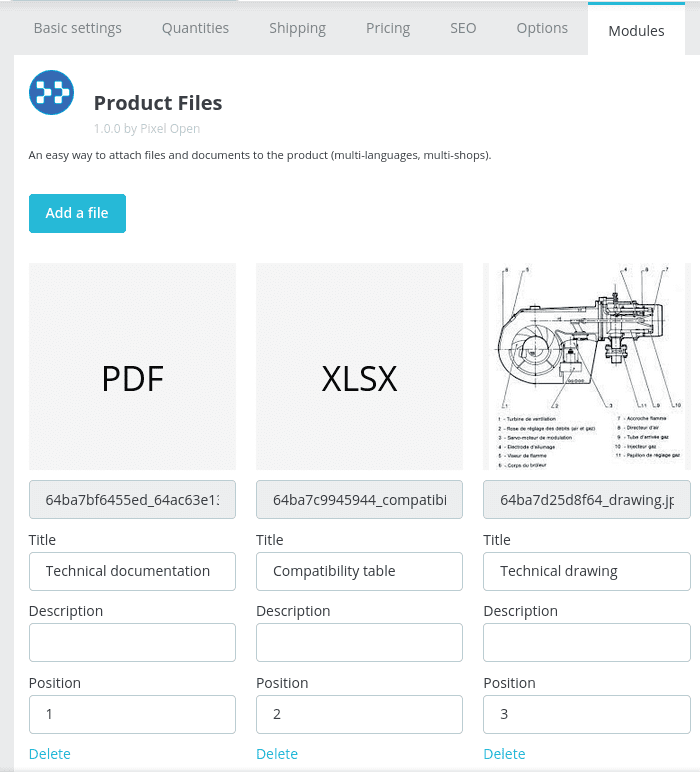
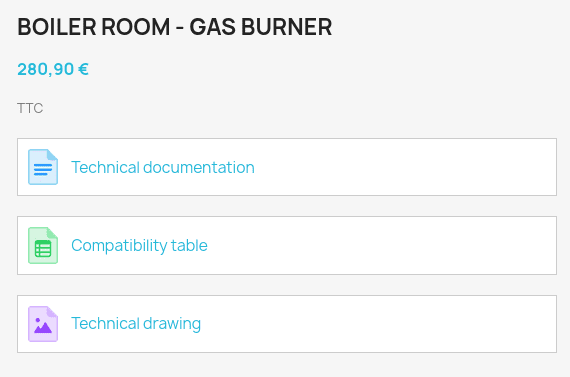
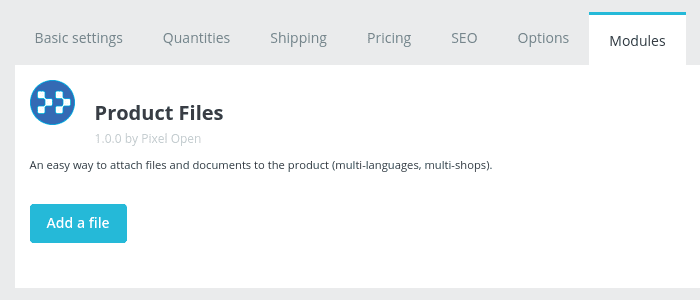
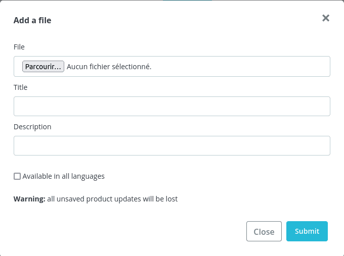

# Prestashop Product Files

[](https://php.net/)
[](https://www.prestashop.com)
[](https://github.com/Pixel-Open/prestashop-product-files/releases)

## Presentation

An easy way to attach files and documents to the product (multi-languages, multi-shops).

* Add files to the product in the admin. Multi-shops and multi-languages compatible.
* Display files on the frontend with a widget.





## Requirements

- Prestashop >= 1.7.6.0 / Prestashop >= 8.0 / Prestashop >= 9.0
- PHP >= 7.4.0

## Installation

Download the **pixel_product_files.zip** file from the [last release](https://github.com/Pixel-Open/prestashop-product-files/releases/latest) assets.

### Admin

Go to the admin module catalog section and click **Upload a module**. Select the downloaded zip file.

### Manually

Move the downloaded file in the Prestashop **modules** directory and unzip the archive. Go to the admin module catalog section and search for "File".

## Configuration

### Admin

On the product page in admin, select "Modules", then "Configure" for the "Product Files" module.



Click "Add a file" to attach a file to the product.

When the shop is multi-shops or multi-languages, the file will be assigned to the current shop in the current language, except if the "Available in all shops/languages" option is checked.



The title and description fields are localizable.

### Widget

In the product page template, add the following Widget:

```smarty
{widget name='pixel_product_files'}
```

**Widget options:**

* **id_product:** Force the display for the given product id
* **id_shop:** Force the display for the given shop id
* **id_lang:** Force the display for the given language id
* **template:** Custom template path
* **icons_path:** Custom icon images base URL

Example:

```smarty
{widget name='pixel_product_files' id_product='1' id_lang='1' id_shop='1' template='module:pixel_product_files/product-files.tpl' icons_path="`$urls.base_url`img/file-icons/"}
```

With `product-files.tpl` in `themes/{themeName}/modules/pixel_product_files/product-files.tpl` directory.

### Template

In a custom template, browse the files as follows:

```smarty
{foreach from=$files item=file}
    {assign var="extension" value=$file->getFile()|pathinfo:$smarty.const.PATHINFO_EXTENSION}

    File URL: {$path.docs}{$file->getFile()}
    Icon: {$path.icons}{$icons[$extension]}
    Title: {$file->getTitle()}
    Description: {$file->getDescription()}
{/foreach}
```

### Icons

Frontend file icons are divided into several categories:

| Category     | Icon             | File extensions                                            |
|--------------|------------------|------------------------------------------------------------|
| Document     | document.png     | pdf, odt, doc, opt, docx, rtf                              |
| Table        | table.png        | csv, ods, xls, xlsx                                        |
| Presentation | presentation.png | pptx, pptm, ppt, odp                                       |
| Image        | image.png        | png, gif, svg, webp, jpeg, jpg, bmp, avif, apng, ico, tiff |
| Video        | video.png        | avi, mp4, m4v                                              |
| Audio        | audio.png        | mp3, ogg, flac, wav, m4a, wma, aac                         |
| Archive      | archive.png      | zip, rar, gz, tar, bz2, xz, 7z                             |

Other files extension are not allowed.

Set you own icon files with the `icons_path` option:

```smarty
{widget name='pixel_product_files' icons_path="`$urls.base_url`img/file-icons/"}
```

Then add icons in the `img/file-icons` directory:

* /img/file-icons/document.png
* /img/file-icons/table.png
* /img/file-icons/presentation.png
* ...

In the template, display the icon as follows:

```smarty
{foreach from=$files item=file}
    {assign var="extension" value=$file->getFile()|pathinfo:$smarty.const.PATHINFO_EXTENSION}
    {if isset($icons[$extension])}
        getTitle()}" />
    {/if}
{/foreach}
```
